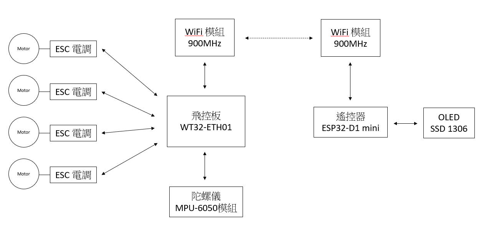

# WT32-ETH01_FC

這個專案有兩部分：以 **WT32-ETH01** 製作的四軸飛行控制板，以及以 **ESP32 D1 mini** 製作的遙控器。
兩者的設定網頁都放在 SPIFFS（`data/index.html`、`style.css`、`app.js`），用瀏覽器開啟後以側邊欄切換頁面。

```
fc_wt32eth01/      飛控板韌體（Arduino sketch）
  data/            飛控網頁（SPIFFS）
rc_d1mini/         遙控器韌體（Arduino sketch）
  data/            遙控器網頁（與飛控相同，依裝置自動顯示對應功能）
docs/              接腳圖、規格書、系統架構圖
```

## 系統架構



架構圖中的「900MHz WiFi 模組」在程式裡假設為 **WiFi HaLow（802.11ah）橋接模組**：

- **飛控端**：HaLow 模組以網路線接 WT32-ETH01 的 RJ45。
- **遙控器端**：ESP32 用 2.4GHz WiFi 連上 HaLow 模組（在「網路設定」中掃描並選擇它的 SSID）。
- 兩端在同一個 IP 網段，遙控器以 **UDP** 送控制封包到飛控的 4210 埠，飛控回傳遙測到遙控器的 4211 埠。封包格式見 `protocol.h`，兩個專案的 `protocol.h` 必須保持一致。

不使用 HaLow 也可以運作：飛控板的板載 WiFi 同樣會接收 UDP，兩者連到同一台路由器即可。

## 網頁功能

| 頁面 | 飛控板 | 遙控器 |
|---|---|---|
| 系統狀態 | 飛行狀態、WiFi 連線資訊、RJ45 狀態、SPIFFS 檔案與容量 | 遙控／飛控連線狀態、WiFi 連線資訊、SPIFFS 檔案與容量 |
| 網路設定 | WiFi：掃描 SSID、手動輸入、清除設定<br>RJ45：DHCP／固定 IP | WiFi：掃描 SSID、手動輸入、清除設定<br>飛控連線：目標 IP 與埠 |
| PID 設定 | 即時姿態儀、Roll／Pitch／Yaw PID、自穩強度、水平校正 | — |
| OTA 更新 | 上傳韌體或 SPIFFS 映像 | 上傳韌體或 SPIFFS 映像 |
| 使用者設定 | 變更登入帳號及密碼 | 變更登入帳號及密碼 |

- 所有頁面和 API 都需要登入（HTTP Basic Auth）。**預設帳號／密碼：`admin` / `admin`**，請在第一次登入後修改。
- 沒有設定 WiFi，或 STA 連線失敗超過 20 秒時，裝置會開啟 AP：
  - 飛控：`WT32-FC-XXXX`；遙控器：`RC-Remote-XXXX`
  - AP 密碼：`12345678`
  - 網址：`http://192.168.4.1`
- STA 連上 30 秒後 AP 會自動關閉。之後可以用新 IP，或 mDNS 網址 `http://wt32-fc.local`、`http://rc-remote.local` 連線。
- 飛控也可以從 RJ45 的 IP 開啟網頁（DHCP 取得的 IP 可在路由器上查到）。
- **安全機制：飛控解鎖時**，飛控會拒絕 OTA、重新啟動、WiFi 與 RJ45 變更；遙控器也會拒絕可能中斷遙控連線的操作。

## 硬體接線

接腳圖：[docs/gpio_pin腳圖.png](docs/gpio_pin腳圖.png)

### 飛控板（WT32-ETH01）

WT32-ETH01 的乙太網路已佔用 GPIO 0/16/18/19/21/22/23/25/26/27。

| 功能 | GPIO | 備註 |
|---|---|---|
| MPU-6050 SDA | 33 | 板型預設 I2C |
| MPU-6050 SCL | 32 | |
| ESC M1 右後（CW） | 2 | |
| ESC M2 右前（CCW） | 4 | |
| ESC M3 左後（CCW） | 14 | |
| ESC M4 左前（CW） | 15 | |
| 電池電壓（選用） | 36 | 需分壓電阻，在 `config.h` 設定 `VBAT_PIN` |

```
      M4(FL,CW)   M2(FR,CCW)     ↑ 機頭
              \   /
               [ ]
              /   \
      M3(RL,CCW)  M1(RR,CW)
```

- 避開 GPIO12：它是開機 strapping 腳，被拉高會無法開機。
- MPU-6050 安裝方向：晶片 X 軸箭頭朝機頭，元件面朝上。
- 電調訊號預設為 400Hz PWM（1000–2000µs）。若電調只吃 50Hz，請修改 `ESC_FREQ_HZ`。
- 電調與 WT32-ETH01 必須共地。

### 遙控器（ESP32 D1 mini）

| 功能 | GPIO | 備註 |
|---|---|---|
| 油門搖桿 | 36 (SVP) | 搖桿必須接 ADC1（WiFi 開啟時 ADC2 不能用） |
| Yaw 搖桿 | 39 (SVN) | |
| Pitch 搖桿 | 34 | |
| Roll 搖桿 | 35 | |
| 解鎖開關 | 25 | 撥到 GND = 解鎖（內部上拉） |
| OLED SDA | 21 | SSD1306 128×64，位址 0x3C |
| OLED SCL | 22 | |

- 開機時會取 Roll／Pitch／Yaw 搖桿的中點，**開機時請勿碰觸搖桿**。
- 油門用絕對值對應（`THROTTLE_RAW_MIN`～`THROTTLE_RAW_MAX`）。若用會自動回中的搖桿當油門，回中位置就是 50% 油門，建議換成不回中的搖桿。
- 搖桿方向相反時，修改 `config.h` 的 `INVERT_*`。

## 編譯與燒錄

需要：

- Arduino IDE 2.x
- **Arduino-ESP32 核心 3.x**（已用 3.3.12 編譯驗證）
- 函式庫：**ArduinoJson 7.x**、**Adafruit SSD1306**、**Adafruit GFX**（後兩者只有遙控器需要）

| 專案 | 開發板 | Partition Scheme |
|---|---|---|
| `fc_wt32eth01` | WT32-ETH01 Ethernet Module | Default 4MB with spiffs (1.2MB APP/1.5MB SPIFFS) |
| `rc_d1mini` | WEMOS D1 MINI ESP32 | Default 4MB with spiffs (1.2MB APP/1.5MB SPIFFS) |

目前韌體大小：飛控約 1.15MB、遙控器約 1.08MB，APP 分區上限是 1.25MB。

> IDE 對 WT32-ETH01 顯示的「最大 8388608 位元組」是開發板定義的錯誤，實際上限是 1.25MB。

WT32-ETH01 沒有 USB：用 USB-TTL 接 TX0(GPIO1)／RX0(GPIO3)，**GPIO0 接 GND 後上電**進入燒錄模式。

### 上傳網頁檔（SPIFFS）

擇一即可：

1. **IDE 外掛**：安裝 Arduino IDE 2.x 的 `arduino-spiffs-upload` 外掛（.vsix 放進 `~/.arduinoIDE/plugins/`），重開 IDE 後按 `Ctrl+Shift+P` →「Upload SPIFFS to Pico/ESP8266/ESP32」。上傳前請關閉序列埠監控視窗。
2. **自己產生映像，再用 OTA 上傳**：
   ```
   mkspiffs -c fc_wt32eth01/data -b 4096 -p 256 -s 0x160000 fc_spiffs.bin
   ```
   `mkspiffs` 在 `%LOCALAPPDATA%\Arduino15\packages\esp32\tools\mkspiffs\` 裡。產生後到「OTA 更新」頁選「網頁檔 (SPIFFS .bin)」上傳。
   還沒上傳過網頁檔時，首頁會顯示一個救援上傳頁面，也可以在那裡上傳。

韌體 OTA 用的 `.bin`：在 IDE 選「草稿碼 → 匯出已編譯的二進位檔」，取 `*.ino.bin`。

## 飛行控制

### 控制流程

`flight.cpp` 在核心 1 以 250Hz 執行：

1. **姿態估測**：讀取 MPU-6050（±500°/s、±8g，DLPF 約 44Hz），以互補濾波（α=0.99）融合陀螺儀與加速度計。有額外加速度時（|a| 不在 0.85～1.15g 之間）只信任陀螺儀。
2. **角度環（P）**：搖桿傾角 → 目標角速度。強度為「角度環 Kp」，搖桿滿舵對應「最大傾角」。
3. **角速度環（PID）**：Roll／Pitch／Yaw 各一組，D 項取測量值微分並加 40Hz 低通，積分有上限。
4. **X 型混控**：任一馬達超過上限時，四顆一起下移，保留姿態修正量。

網路與網頁在核心 0／`loop()` 執行，不會阻塞控制迴圈。

### 解鎖／上鎖

- **解鎖條件**：遙控連線中、解鎖開關由 OFF 撥到 ON、油門 < 5%、機身傾斜 < 25°、IMU 正常、不在校正或 OTA 中。
- 開機時開關若已在 ON，需先撥回 OFF 再撥 ON。
- 油門 < 10% 時不套用 PID，馬達維持怠速。

**自動上鎖**的情況：

- 遙控器開關撥到 OFF
- IMU 讀取失敗
- 傾斜超過 75° 持續 0.3 秒（翻機保護）
- OTA 或重新啟動

### 失控保護

超過 0.5 秒收不到遙控封包時，飛控會保持水平，並在 3 秒內把油門從最後的值線性降到 0，然後上鎖。
本機沒有氣壓計，所以這**不是**定高降落，只是減緩墜落。期間遙控恢復且開關仍為 ON，會回到正常控制。

飛控會鎖定第一個送封包來的遙控器 IP，直到斷線超過 3 秒才接受其他來源。

### 第一次試飛前（請拆下螺旋槳）

1. **IMU 方向**：在「PID 設定」頁看姿態儀。機身右側向下時 Roll 應為正，抬頭時 Pitch 應為正，機頭向右轉時 Yaw 應為正。不符合時，修改 `flight.cpp` 中 `rate[...]` 與 `accRoll`／`accPitch` 的符號，或調整 MPU-6050 的安裝方向。
2. **水平校正**：機身放在水平面上，按「水平校正」。
3. **電調行程校正**：依電調說明書做油門行程校正（1000～2000µs）。
4. **馬達順序與轉向**：解鎖後輕推油門，確認 M1～M4 位置與轉向和上圖一致。
5. **修正方向**：手持機身（無槳）讓它傾斜，確認較低一側的馬達轉速上升。
6. **PID**：預設值只是保守起點，必須依機架、馬達與槳調整。
   - 先調 Roll／Pitch 的 Kp，到出現快速抖動再降回約 70%。
   - 再加 Kd 抑制過衝。
   - 最後加 Ki 消除飄移。
   - 網頁上的修改會立即套用並存入 NVS。

## 可在 `config.h` 調整的項目

| 項目 | 參數 |
|---|---|
| 腳位 | `PIN_*` |
| 電調頻率與怠速 | `ESC_FREQ_HZ`、`MOTOR_IDLE_US` |
| 油門上限 | `THROTTLE_MAX_US` |
| 失控保護時間 | `LINK_TIMEOUT_MS`、`FAILSAFE_DESCENT_MS` |
| 解鎖條件 | `ARM_THROTTLE_MAX`、`MAX_ARM_TILT_DEG` |
| 翻機保護 | `CRASH_TILT_DEG`、`CRASH_TIME_MS` |
| UDP 埠 | `LINK_UDP_PORT` |
| AP 密碼與預設帳密 | `AP_PASSWORD`、`DEFAULT_USER`、`DEFAULT_PASS` |

## 注意事項

- 網頁使用 HTTP Basic Auth，沒有加密，只適合在自己的區域網路使用。
- `data/` 與 `protocol.h` 在兩個專案各有一份且內容相同。修改其中一份時，請同步複製到另一份。
- 網頁 PID 存檔時寫入 NVS，會讓控制迴圈延遲數毫秒（電調輸出由硬體 PWM 維持）。建議在地面調參。
